<div align="center">

# 🌿 BODHI CODE EDITOR

### *Next-Generation Desktop Code Editor Built for Speed, Extensibility & Intelligence*

[-5DD62C?style=for-the-badge&logo=rocket&logoColor=white)](https://github.com/)
[](https://www.electronjs.org/)
[](https://react.dev/)
[](https://www.typescriptlang.org/)
[](https://microsoft.github.io/monaco-editor/)
[](https://tailwindcss.com/)
[](https://vitejs.dev/)

<p align="center">
  <a href="#-architecture-deep-dive">Architecture</a> •
  <a href="#-core-capabilities">Capabilities</a> •
  <a href="#-multi-model-ai-copilot">AI Engine</a> •
  <a href="#-git-control--churn-heatmap">Git & Churn</a> •
  <a href="#-extension-ecosystem">Extensions</a> •
  <a href="#-keyboard-shortcuts">Shortcuts</a> •
  <a href="#-getting-started">Getting Started</a>
</p>

---

</div>

## 🌟 Overview

**Bodhi** is an ultra-fast, modern desktop code editor designed for developers who demand peak performance, sleek glassmorphic aesthetics, and seamless developer workflows. Engineered on **Electron 34**, **React 18**, **Monaco Editor**, and **xterm.js**, Bodhi delivers a full-fledged IDE experience with multi-model AI copilot integration, an Open VSX extension ecosystem, Git code-churn heatmaps, and native multi-tab PTY terminal emulation.

---

## 🏛️ Architecture Deep-Dive

Bodhi enforces a strict multi-process architecture with zero-trust renderer isolation, type-safe IPC communication, and dedicated background workers.

```mermaid
graph TB
    subgraph Electron_Main_Process ["🖥️ Electron Main Process (Node.js & Native OS)"]
        direction TB
        AppLifecycle["⚡ App & Window Manager<br/>(Main Window, Settings & Extension Windows)"]
        
        subgraph Native_Services ["Core Native Services"]
            FileSvc["📁 FileService<br/>• Disk I/O & Traversal<br/>• Chokidar Live Watcher"]
            TermSvc["💻 TerminalService<br/>• node-pty Native Bridge<br/>• Multi-shell PTY Spawner"]
            GitSvc["🔀 GitService<br/>• CLI Status / Stage / Commit<br/>• Line Churn Heatmap Engine"]
            AISvc["🧠 AIService<br/>• Multi-Provider Router<br/>• Gemini / OpenAI / Claude"]
            ExtSvc["🧩 ExtensionService<br/>• Open VSX Marketplace<br/>• VSIX Unpacker & Theme Injector"]
            SearchSvc["🔍 SearchService<br/>• Regex Workspace Search<br/>• Batch File Replacements"]
        end

        IPCHandlers["📡 Secure IPC Handler Layer (ipcMain)"]
        AppLifecycle --> Native_Services
        Native_Services <--> IPCHandlers
    end

    subgraph Security_Boundary ["🛡️ Preload Security Boundary (contextBridge)"]
        PreloadBridge["🔒 BodhiAPI Bridge (window.bodhiAPI)<br/>• Strongly-typed Promises<br/>• Unidirectional Event Listeners<br/>• Zero Raw Node.js Exposure"]
    end

    subgraph Renderer_Process ["🎨 Renderer Layer (React 18 + Monaco + Zustand)"]
        direction TB
        
        subgraph Global_Stores ["State Management (Zustand 5)"]
            StoreEditor["useEditorStore<br/>(Tabs, Active Buffers, Layout)"]
            StoreWorkspace["useWorkspaceStore<br/>(File Tree, Watchers, Recents)"]
            StoreGit["useGitStore<br/>(Status, Staging, Diffs, Blame)"]
            StoreExt["useExtensionStore<br/>(Marketplace, Themes, Snippets)"]
        end

        subgraph UI_Modules ["High-Performance UI Modules"]
            TitleBar["🪟 Custom TitleBar & Window Controls"]
            Sidebar["📂 Sidebar (Explorer | Search | Git | AI | Ext)"]
            EditorEngine["📝 Monaco Multi-Tab & Split Editor Engine"]
            DiffEngine["⚖️ Side-by-Side Diff Viewer"]
            MarkdownEngine["👁️ Real-Time Markdown Previewer"]
            TerminalPanel["💻 Multi-Session xterm.js Terminal Dock"]
            CommandPal["⚡ Fuzzy Command Palette & Quick Open"]
            SettingsWin["⚙️ Preferences & Keybinding Manager"]
        end

        Global_Stores <--> UI_Modules
    end

    IPCHandlers <==>|Typed IPC Channels| PreloadBridge
    PreloadBridge <==>|window.bodhiAPI| Global_Stores
```



### Architectural Highlights

| Layer | Responsibility & Implementation |
|---|---|
| **Main Process** | Node.js 22 runtime orchestrating native OS bindings, `node-pty` terminal spawning, `chokidar` file system watching, `git` CLI operations, and secure HTTPS API requests to LLM providers. |
| **Preload Bridge** | Hardened `contextBridge` exposing `window.bodhiAPI`. Runs with `contextIsolation: true` and `nodeIntegration: false`, preventing cross-site scripting (XSS) and remote code execution vulnerabilities. |
| **Renderer Process** | React 18 frontend packaged with Vite 6. Powered by Zustand 5 for fine-grained reactivity, Tailwind CSS for pixel-perfect dark glassmorphism, and Monaco Editor 0.52 for code intelligence. |
| **Multi-Window System** | Independent dedicated BrowserWindow instances for modal tasks (Settings, Extensions Marketplace) with bidirectional IPC state synchronization. |

---

## ⚡ Core Capabilities

### 📝 Monaco Multi-Tab & Split Editor Engine
- **Multi-Tab Buffer Management**: Dirty/unsaved indicators (`●`), tab reordering, middle-click tab closure, and contextual tab menus.
- **Split Editor Mode (<kbd>Ctrl</kbd> + <kbd>\</kbd>)**: Dual-pane side-by-side editing with synchronized active buffers and independent tab strips.
- **Markdown Live Preview (<kbd>Ctrl</kbd> + <kbd>Shift</kbd> + <kbd>V</kbd>)**: High-speed live HTML rendering powered by `marked` with GitHub Flavored Markdown support.
- **Rich Font & Ligature Registry**: Pre-configured support for JetBrains Mono, Fira Code, Cascadia Code, SF Mono, and custom developer fonts with configurable line-height and cursor blinking animations.
- **Auto-Save & Format on Save**: Debounced auto-save engine with configurable delay intervals and safe atomic file writes.

### 🧠 Multi-Model AI Copilot & Chat
- **Multi-Provider LLM Gateway**: Native client support for **Google Gemini** (*Gemini 2.5 Pro / 2.0 Flash*), **OpenAI** (*GPT-4o / GPT-4o-mini*), and **Anthropic** (*Claude 3.5 Sonnet / Claude 3.5 Haiku*).
- **Smart Key Auto-Detection**: Automatically detects provider configuration from API key signatures (`AIzaSy...`, `sk-ant-...`, `sk-...`).
- **Context-Aware AI Sidebar (<kbd>Ctrl</kbd> + <kbd>Shift</kbd> + <kbd>I</kbd>)**: Interactive chat drawer aware of your active file, selection, and language with 1-click code insertion.
- **Inline AI Code Editing (<kbd>Ctrl</kbd> + <kbd>K</kbd>)**: In-place refactoring, unit test generation, docstring synthesis, and bug fixing directly within Monaco buffers.

### 🔀 Git Source Control & Code Churn Heatmap
- **Visual Git Workspace**: Real-time status tracking for Staged, Unstaged, and Untracked files with status badges (`M`, `A`, `D`, `U`, `??`).
- **Diff Viewer Engine**: Interactive side-by-side diff viewer with Monaco Diff Editor against `HEAD`.
- **Atomic Operations**: 1-click stage, unstage, discard, and commit with custom messages.
- **🔥 Git Line Churn Heatmap**: Visual 5-level flame scale calculating commit frequency and author recency per line, helping identify legacy debt and hot code paths.

### 🧩 Open VSX Marketplace & Extension Engine
- **Open VSX Registry Integration**: Search, download, and install thousands of extensions directly from the open-source extension registry.
- **Direct VSIX Packaging**: Drag-and-drop or browse local `.vsix` archives for offline extension installation.
- **Dynamic Monaco Autocompletions**: Parses extension snippet definitions and injects them dynamically into Monaco language completions.
- **VS Code Theme Parser**: Imports TextMate and VS Code JSON themes (`.json` / `.tmTheme`) directly into Monaco’s runtime theme engine.

### 💻 Integrated Multi-Shell Terminal Dock
- **Native PTY Backend**: Full interactive terminal sessions powered by `node-pty` and `@xterm/xterm` with `@xterm/addon-fit`.
- **Multi-Shell Profiles**: Automatic detection and selection for **PowerShell**, **Command Prompt**, **WSL (Bash)**, and custom shell paths.
- **Split Terminal Panels (<kbd>Ctrl</kbd> + <kbd>Shift</kbd> + <kbd>5</kbd>)**: Run concurrent side-by-side shells within the bottom dock.
- **Terminal Buffer Search**: Dedicated in-terminal search widget (<kbd>Ctrl</kbd> + <kbd>F</kbd>) with live match highlighting.

### 🔍 Global Search & Replace
- **Workspace-Wide Scan**: Fast recursive search across all files with Regex, match case, and whole-word toggles.
- **Glob Pattern Filtering**: Include or exclude paths using glob patterns (e.g., `*.ts`, `!**/node_modules/**`).
- **Batch Replace**: Safe multi-file atomic text replacements with summary statistics.

### ⚡ Universal Command Palette & Quick Navigation
- **Command Palette (<kbd>Ctrl</kbd> + <kbd>Shift</kbd> + <kbd>P</kbd>)**: Fuzzy search across every editor command, Git action, and preference toggle.
- **Quick Open File Picker (<kbd>Ctrl</kbd> + <kbd>P</kbd>)**: Instant file jumper with keyboard navigation and path fuzzy scoring.
- **Recent Projects Switcher (<kbd>Ctrl</kbd> + <kbd>R</kbd>)**: Quick workspace switcher with persistent history.
- **Interactive Onboarding (<kbd>F1</kbd>)**: Built-in interactive walkthrough to guide new developers through Bodhi's capabilities.

---

## ⌨️ Keyboard Shortcuts

| Category | Shortcut (Win/Linux) | Shortcut (macOS) | Action |
|---|---|---|---|
| **Navigation** | <kbd>Ctrl</kbd> + <kbd>P</kbd> | <kbd>Cmd</kbd> + <kbd>P</kbd> | Quick Open File |
| | <kbd>Ctrl</kbd> + <kbd>Shift</kbd> + <kbd>P</kbd> | <kbd>Cmd</kbd> + <kbd>Shift</kbd> + <kbd>P</kbd> | Universal Command Palette |
| | <kbd>Ctrl</kbd> + <kbd>R</kbd> | <kbd>Cmd</kbd> + <kbd>R</kbd> | Switch Recent Workspace |
| | <kbd>F1</kbd> | <kbd>F1</kbd> | Open Interactive Walkthrough |
| **Editor** | <kbd>Ctrl</kbd> + <kbd>S</kbd> | <kbd>Cmd</kbd> + <kbd>S</kbd> | Save Active Buffer |
| | <kbd>Ctrl</kbd> + <kbd>Shift</kbd> + <kbd>S</kbd> | <kbd>Cmd</kbd> + <kbd>Shift</kbd> + <kbd>S</kbd> | Save All Open Buffers |
| | <kbd>Ctrl</kbd> + <kbd>W</kbd> | <kbd>Cmd</kbd> + <kbd>W</kbd> | Close Active Tab |
| | <kbd>Ctrl</kbd> + <kbd>\</kbd> | <kbd>Cmd</kbd> + <kbd>\</kbd> | Toggle Split Editor (Dual Pane) |
| | <kbd>Ctrl</kbd> + <kbd>Shift</kbd> + <kbd>V</kbd> | <kbd>Cmd</kbd> + <kbd>Shift</kbd> + <kbd>V</kbd> | Toggle Markdown Live Preview |
| | <kbd>Ctrl</kbd> + <kbd>,</kbd> | <kbd>Cmd</kbd> + <kbd>,</kbd> | Open Settings Window |
| **Views & Panels** | <kbd>Ctrl</kbd> + <kbd>B</kbd> | <kbd>Cmd</kbd> + <kbd>B</kbd> | Toggle Sidebar Drawer |
| | <kbd>Ctrl</kbd> + <kbd>Shift</kbd> + <kbd>E</kbd> | <kbd>Cmd</kbd> + <kbd>Shift</kbd> + <kbd>E</kbd> | Focus File Explorer |
| | <kbd>Ctrl</kbd> + <kbd>Shift</kbd> + <kbd>F</kbd> | <kbd>Cmd</kbd> + <kbd>Shift</kbd> + <kbd>F</kbd> | Focus Global Search & Replace |
| | <kbd>Ctrl</kbd> + <kbd>Shift</kbd> + <kbd>G</kbd> | <kbd>Cmd</kbd> + <kbd>Shift</kbd> + <kbd>G</kbd> | Focus Source Control (Git) |
| | <kbd>Ctrl</kbd> + <kbd>Shift</kbd> + <kbd>I</kbd> | <kbd>Cmd</kbd> + <kbd>Shift</kbd> + <kbd>I</kbd> | Focus AI Assistant Chat |
| | <kbd>Ctrl</kbd> + <kbd>Shift</kbd> + <kbd>X</kbd> | <kbd>Cmd</kbd> + <kbd>Shift</kbd> + <kbd>X</kbd> | Open Extensions Marketplace |
| **Terminal** | <kbd>Ctrl</kbd> + <kbd>`</kbd> | <kbd>Cmd</kbd> + <kbd>`</kbd> | Toggle Terminal Dock |
| | <kbd>Ctrl</kbd> + <kbd>Shift</kbd> + <kbd>`</kbd> | <kbd>Cmd</kbd> + <kbd>Shift</kbd> + <kbd>`</kbd> | Create New Shell Session |
| | <kbd>Ctrl</kbd> + <kbd>Shift</kbd> + <kbd>5</kbd> | <kbd>Cmd</kbd> + <kbd>Shift</kbd> + <kbd>5</kbd> | Split Terminal Session |
| **Zoom** | <kbd>Ctrl</kbd> + <kbd>+</kbd> / <kbd>-</kbd> / <kbd>0</kbd> | <kbd>Cmd</kbd> + <kbd>+</kbd> / <kbd>-</kbd> / <kbd>0</kbd> | Zoom In / Out / Reset Zoom |

---

## 📁 Repository Structure

```text
Bodhi/
├── docs/                        # Architecture & implementation records
├── resources/                   # Desktop icons, branding & license terms
├── src/
│   ├── main/                    # Electron Main Process (Node.js)
│   │   ├── services/
│   │   │   ├── aiService.ts         # Multi-model AI router (Gemini, OpenAI, Claude)
│   │   │   ├── extensionService.ts  # Open VSX client & VSIX package manager
│   │   │   ├── fileService.ts       # File I/O & Chokidar directory watcher
│   │   │   ├── gitService.ts        # Git CLI status, diffs, & line churn engine
│   │   │   ├── searchService.ts     # Workspace regex search & batch replace
│   │   │   └── terminalService.ts   # node-pty shell sessions & stream manager
│   │   ├── ipcHandlers.ts           # Type-safe IPC channels & registrations
│   │   └── index.ts                 # BrowserWindow lifecycle & window routing
│   ├── preload/                 # Preload Context Isolation Boundary
│   │   ├── index.ts                 # BodhiAPI contextBridge implementation
│   │   └── index.d.ts               # Global Window.bodhiAPI TypeScript definitions
│   ├── renderer/                # React 18 + Tailwind CSS + Monaco Frontend
│   │   ├── src/
│   │   │   ├── assets/              # Logos & visual UI assets
│   │   │   ├── components/          # Modular React UI components
│   │   │   │   ├── AboutModal/          # Application diagnostics & credits
│   │   │   │   ├── CommandPalette/      # Fuzzy search command palette
│   │   │   │   ├── common/              # Reusable buttons, badges, & icons
│   │   │   │   ├── Editor/              # Monaco editor, tabs, diff, markdown
│   │   │   │   ├── ExtensionsWindow/    # Marketplace manager window
│   │   │   │   ├── SettingsWindow/      # Preferences & AI keys configuration
│   │   │   │   ├── Sidebar/             # Explorer, Search, Git, AI chat panels
│   │   │   │   ├── Terminal/            # xterm.js instance & search widgets
│   │   │   │   ├── TermsModal/          # License & terms agreement
│   │   │   │   ├── TitleBar/            # Frameless title bar & window controls
│   │   │   │   ├── WelcomeWalkthrough/  # Onboarding walkthrough
│   │   │   │   ├── StatusBar.tsx        # Cursor, encoding, branch metrics
│   │   │   │   └── TitleBar.tsx         # Title bar orchestrator
│   │   │   ├── hooks/               # Keyboard shortcuts & window hooks
│   │   │   ├── store/               # Zustand state stores (Editor, Workspace, Git, Ext)
│   │   │   ├── theme/               # Monaco themes & font registry
│   │   │   ├── utils/               # Path, debounce, & formatting utilities
│   │   │   ├── App.tsx              # Root application layout orchestrator
│   │   │   ├── index.css            # Tailwind directives & CSS design tokens
│   │   │   └── main.tsx             # React DOM entry point
│   │   └── index.html               # Main HTML template
│   └── shared/                  # Universal Isomorphic Types & Constants
│       ├── constants.ts             # IPC channel string enums
│       └── types.ts                 # BodhiAPI interface & shared data models
├── electron.vite.config.ts      # Multi-target Vite bundler configuration
├── electron-builder.yml         # Desktop installer packaging specification
├── tailwind.config.ts           # Design system tokens & color extensions
└── tsconfig.json                # Project TypeScript configuration
```

---

## 🚀 Getting Started

### Prerequisites
- **Node.js**: `v20.x` or `v22.x` (LTS recommended)
- **npm**: `v10.x` or higher
- **Git**: Installed and available in your system `$PATH`
- **Native Build Tools**: `python3` and C++ build tools (required for `node-pty` compilation)
  - *Windows*: `npm install --global --production windows-build-tools` or Visual Studio C++ Build Tools
  - *macOS*: Xcode Command Line Tools (`xcode-select --install`)
  - *Linux*: `sudo apt install build-essential python3`

---

### Installation & Setup

```bash
# 1. Clone the repository
git clone https://github.com/your-username/bodhi.git
cd bodhi

# 2. Install dependencies
npm install

# 3. Start development environment (Vite + Electron live-reload)
npm run dev
```

---

### Validation & Building

```bash
# Run TypeScript validation across Node & Renderer targets
npm run typecheck

# Build optimized production bundles for Main, Preload, and Renderer
npm run build

# Package unpacked desktop distribution
npm run build:unpack
```

### Platform Packaging

```bash
# Build Windows installer (.exe)
npm run build:win

# Build macOS bundle (.dmg / .zip)
npm run build:mac

# Build Linux AppImage / Debian package
npm run build:linux
```

---

## ⚙️ AI Engine Configuration

Bodhi lets you configure your preferred AI provider in **Settings (<kbd>Ctrl</kbd> + <kbd>,</kbd>) → AI Assistant**:

```json
{
  "aiModelProvider": "google-gemini", // "google-gemini" | "openai" | "anthropic"
  "aiApiKey": "your-api-key-here",
  "aiTemperature": 0.2,
  "aiMaxTokens": 2048
}
```

> **Tip**: You can also provide API keys via environment variables:
> - `GEMINI_API_KEY`
> - `OPENAI_API_KEY`
> - `ANTHROPIC_API_KEY`

---

## 🛡️ Security & Privacy

- **Renderer Sandboxing**: `nodeIntegration: false`, `contextIsolation: true`, and strict CSP headers.
- **Secure File System Access**: File mutations and execution are confined to the main process behind explicit IPC contracts.
- **Direct LLM Communication**: AI requests are dispatched directly from the main process to official provider endpoints via HTTPS with zero intermediate telemetry or third-party proxy servers.

---

## 📄 License & Terms

Bodhi is distributed under the terms outlined in [TERMS.md](TERMS.md).  
Designed and engineered with passion for high-performance software craft.
